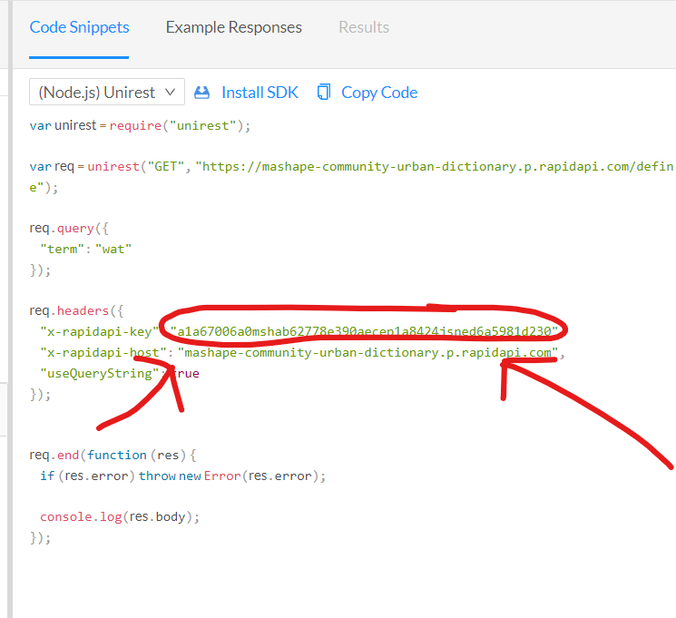

# Python API Wrapper for [RapidApi Urban Dictionary](https://rapidapi.com/community/api/urban-dictionary)

## Info
	Has multiple endpoints, and returns uncut info

To use, head over to RapidApi - Sign Up FREE (No payment method needed), go to [Urban Dictionary API](https://rapidapi.com/community/api/urban-dictionary) and copy the x-rapidapi-key as shown in the snippet below.

## Usage
	import urbandict
	client = urbandict.UrbanClient(api_key="your api key")
	definition = client.get_definition("word")

### Endpoints 
	client.get_definition("word") #returns the definition of "word"
	client.get_stats("word") #returns likes and dislikes
	client.get_url("word") #returns urban dictionary url to the word
	client.get_word_info("word") #returns all of the above in dict form

